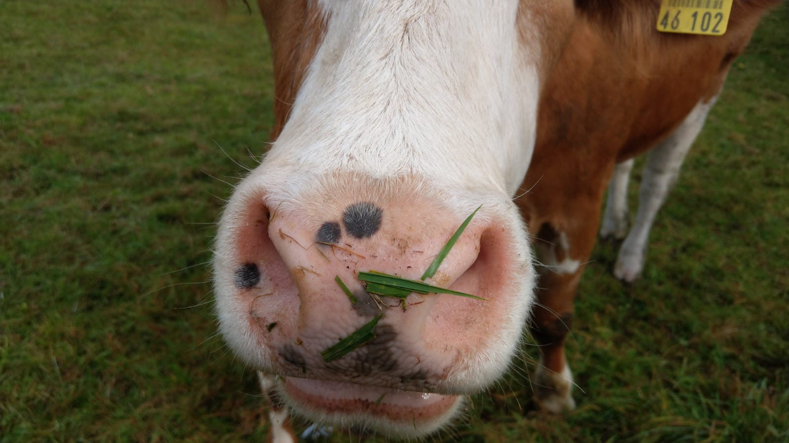

```{r setup, include=FALSE}

pacman::p_load(
  ggplot2,
  tidyverse,
  modelsummary,
  kableExtra,
  palmerpenguins, 
  DT, 
  ggiraph, 
  showtext, 
  leaflet)


```

# Abstract

This hands-on tutorial provides participants with an in-depth understanding of how to build on R Markdown to make their research workflows fully reproducible. Acknowledging the diversity of programming languages (e.g., R, Python, SQL) and types of research outputs (e.g., manuscripts, blog posts) that are common in computational social science, the tutorial showcases an integrated and automated R Markdown research project workflow. It familiarizes participants with the basic logic of R Markdown for research outputs, while extending this basic logic for scientific use cases by relying on the power of Pandoc and Lua.


# `r rmarkdown::metadata$title`


## Narrative text and code integration

R Markdown offers a framework to generate reproducible research in various output formats (e.g., PDF reports, HTML documents). This Rmd file is optimized for the seamless integration of text and R code that can result either in a **stable PDF report** or in a **dynamic/interactive HTML report**. The conversion from R code and Markdown text to the respective output format is implemented by the document conversion tool **Pandoc** that ships with the `rmarkdown` library. You can click on the `Knit` button in the RStudio IDE or call `rmarkdown::render("odsc-report.Rmd", "reproducr::reproducr_manuscript")`.


## The 'magic' behind the scenes

When we render R Markdown documents, `knitr` first converts the `.Rmd`-file to a plain `.md`-file that contains the hard-coded output. In the second step, the `.md`-file is then passed to Pandoc and converted to the specified output (e.g. HTML or PDF). The present document relies on the R library [`reproducr`](github.com/jschultecloos/reproducr), which extends this basic rendering logic of R Markdown for some powerful Lua-filters. These Lua-filters help us to achieve maximal flexibility to either generate HTML reports or PDF reports. Key to such flexibility is a self-contained file that contains both literate code which can be rendered to interactive HTML5 content and to well-formatted environments typeset in \LaTeX. Conditional code evaluation and conditional inclusion of certain elements of the report allows us to render different outputs while relying on the same literate code.  

Lua-filters allow us to conditionally include certain elements of the report by manipulating the pandoc abstract syntax tree (AST) between the parsing and the writing phase. To learn more about Lua-filters, check out this [documentation](https://pandoc.org/lua-filters.html#introduction). The following Lua-filters are applied when relying on the `reproducr` library to generate reproducible reports:

- ['not in format' Lua filter](https://github.com/pandoc/lua-filters/blob/master/not-in-format/not-in-format.lua)
- ['scholarly metadata' Lua filter](https://github.com/pandoc/lua-filters/blob/master/scholarly-metadata/scholarly-metadata.lua)
- ['author info blocks' Lua filter](https://github.com/pandoc/lua-filters/blob/master/author-info-blocks/author-info-blocks.lua)
- ['section refs' Lua filter](https://github.com/pandoc/lua-filters/blob/master/section-refs/section-refs.lua)
- ['abstract to meta' Lua filter](https://github.com/pandoc/lua-filters/blob/master/abstract-to-meta/abstract-to-meta.lua)
- ['blinded' Lua filter](https://github.com/jschultecloos/reproducr/blob/master/inst/rmarkdown/lua/blinded.lua) (only optionally activated when `blinded` is set to `true` in the `reproducr::reproducr_manuscript` options.)

We will most frequently interact with the `not-in-format`-filter when producing reproducible reports in R Markdown, and we will discuss some powerful applications of this filter below. 


## Citations

Markdown provides an easy way to cite and reference literature. We add a `bib`-file in our YAML header in the following way:

```{r yaml-bib-file, echo=T, eval=FALSE}
bibliography: literature.bib
csl: 'https://bit.ly/3khj0ZL'
```

We can then cite all entries included in our `.bib`-file by calling `@palmerdata.2020` for inline citations and `[@palmerdata.2020, p.10]` for all other references. Here is an example: the dataset that we use has been created by @palmerdata.2020. If our document specifies a [csl](https://citationstyles.org/) [style](https://www.zotero.org/styles), Pandoc will convert Markdown references, i.e., `@palmerdata.2020`, to 'hard-coded' text and a hyperlink to the reference section in our document. 


## Figures and images

There are several different ways to include images in Rmd documents and we can see two different options to do below. Both approaches allow us to remain flexible regarding the output format of our Rmd document. 


1. Plain markdown syntax: `{width=30%}`

{width=30%}

2. Code evaluation and `knitr`

```{r winter, out.width = "30%", fig.cap="A winter morning", fig.align="center", echo=TRUE}
knitr::include_graphics(path = "figs/winter.jpg")
```

## Tikz pictures

`knitr` also allows us to use the `tikz` engine to draw a `tikzpicture`. Below, we see a simple example on how to use the tikz-engine in R Markdown adapted from [this gallery](https://texample.net/tikz/examples/cycle/).

```{tikz, fig.cap = "A tikz diagram", fig.ext='png', fig.width=3}
\begin{tikzpicture}

\def \n {5}
\def \radius {2cm}
\def \margin {8} % margin in angles, depends on the radius

\foreach \s in {1,...,\n}
{
  \node[draw, circle] at ({360/\n * (\s - 1)}:\radius) {$\s$};
  \draw[->, >=latex] ({360/\n * (\s - 1)+\margin}:\radius) 
    arc ({360/\n * (\s - 1)+\margin}:{360/\n * (\s)-\margin}:\radius);
}
\end{tikzpicture}
```

## Equations

We can also include equations in our reports by wrapping an equation into two dollar signs `$$` (for full-width-equations) and single dollar signs `$` for inline-equations. 

$$
f\left(k\right) = \binom{n}{k} p^k\left(1-p\right)^{n-k}
$$


## Cross-referencing 

We can cross-reference sections, figures, or tables in our document with the following syntax: `\@ref(fig:winter)`. Here is an example: Figure \@ref(fig:winter) shows a photograph of Munich on a winter morning. If we specify the `colorlinks: true` option in our YAML header, the hyperlinks to the respective figure will be colored. If we do not specify a section label, Pandoc will automatically assign a label based on the title of our header. For more details, see the [Pandoc manual](https://pandoc.org/MANUAL.html#extension-auto_identifiers). 


## Integrating empirical analyses

The key to literate programming [@Knuth.1984] are **code chunks**, which are embedded in our Rmd files. While the default programming engine used in R Markdown documents is the statistical programming software R, a number of other engines are also supported (e.g., the `tikz` engine that we used earlier).

A code chunk opens with three backticks (` ```{r my-code-chunk-label} `) and closes with three backticks (` ``` `). We can easily insert a code chunk using the keyboard shortcut `Ctlr+Alt+I` in the RStudio IDE. It is a good practice to add a label for each code chunk, [using only letters, numbers, or dashes while avoiding any other special characters](https://bookdown.org/yihui/rmarkdown/r-code.html). Note that each code chunk needs to have a **unique name** within our document. 

The `reproducr` library displays all code by default (folded in the HTML output) while it does not display any code by default in the PDF output. If we would like to change this behavior, we can change the respective global `knitr` chunk option, for instance, by: `knitr::opts_chunk$set(echo = FALSE)`, which would hide all code -- even in the HTML output. 


In the stage of explorative data analysis, we may want to dynamically explore our data and research output in interactive tables, graphs, or maps.

### Pandoc's DIV elements

We can add `<div>` elements to our R Markdown documents by wrapping the content into three colons. Such elements help us to include any non-standard elements in our R Markdown document and tell Pandoc to render the respective DIVs only under given conditions, i.e., we apply a **filter** to our R Markdown document.   

```
::: {.special}
This is a special DIV!
:::
```

The `reproducr` library adds such Lua-filters, allowing us to write our document in a way that we enjoy full flexibility to knit either to a polished and well-formatted HTML that includes all our explorative analysis and the interactive elements of our research output or to a polished PDF manuscript typeset with LaTeX.

### Conditional element integration & conditional code evaluation

The `not-in-format` Lua-filter filters any elements of the document that are not meant to stay in the respective output format specified. Thus, when writing our paper and code, we can simply wrap the parts of the document that are exclusive to one output format with three colons, e.g., `::: {.not-in-format .latex}`. This results in the exclusion of any content wrapped in such a DIV in LaTeX output. 

This Lua-filter is very powerful in conjunction with **conditional code evaluation**, which means that we can also decide to (not) evaluate some code chunks depending on our desired output format. We can, for instance, ask `knitr` to conditionally evaluate our code only when the output is HTML by including the following code chunk option: `eval=knitr::is_html_output()`. The following subsection that shows an interactive table (a HTMLwidget generated with the `DT` library) will only be included in the `reproducr::reproducr_draft` mode. 


### Interactive tables with `DT` {#interactive-tables .not-in-format .latex}


::: {.not-in-format .latex}
    
This interactive `DT` table [@Xie.2020a] and this text will not be included in our document when we knit to PDF manuscript mode with `reproducr::reproducr_manuscript`.


```{r interactive-table-datatable, eval=knitr::is_html_output(), echo=TRUE}

datatable = DT::datatable(
  penguins, 
  filter = 'top', 
  options = list(pageLength = 5, 
                 lengthMenu = c(5, 10)), 
  colnames = c('Species', 'Island', 'Bill Length', 'Bill Depth', 
               'Flipper Length', 'Body Mass', 'Sex', 'Year')
  )
datatable
```

:::


### Interactive maps with `leaflet` {#interactive-maps .not-in-format .latex}

::: {.not-in-format .latex}

The [R library `leaflet`](https://rstudio.github.io/leaflet/) provides R bindings for javascript mapping library [leaflet.js](http://leafletjs.com/)].  


```{r leaflet-aarhus, layout="shaded", eval=knitr::is_html_output(), echo=TRUE}

leaflet() %>% 
  addTiles() %>% 
  addMarkers(lat=47.3770496,
             lng=8.5462997,
             popup="ETH Zurich") %>%
  setView(lat=47.3770496,
          lng=8.5462997, zoom=15)

```

:::


### Graphs with `ggplot` and `ggiraph`

We rely on the [`showtext` library](https://github.com/yixuan/showtext) [@Qiu.2020] to load [google fonts](https://fonts.google.com/) that we would like to use in our `ggplot` [@Wickham.2016] annotations. This allows us to create graphs that match the text font in our manuscript. With some additional 'output-conditional' evaluation of the `knitr` chunk that loads the google font, we can easily rely on two different fonts in our graphs depending on whether our manuscript is compiled to HTML or PDF.   

```{r set-ggplot-font-html, eval=knitr::is_html_output()}

## add a font from google fonts
font_add_google(
  name = "Fira Sans",
  family = "Fira Sans"
)

ggplot_font = "Fira Sans"

```

```{r set-ggplot-font-latex, eval=knitr::is_latex_output()}

## add a font from google fonts
font_add_google(
  name = "Crimson Text",
  family = "Crimson Text"
  )

ggplot_font = "Crimson Text"

```


```{r theme-set-ggplot}


ggplot2::theme_set(
  theme_bw() +
    theme(text = element_text(family = ggplot_font)) +
    theme(
      plot.title = element_text(
        hjust = 0.5
        ),
      plot.subtitle = element_text(
        hjust = 0.5
        )
      )
)

```

We create a scatter plot using `ggplot` that shows the body mass (y-axis) and flipper length (x-axis) of three different penguin species included in the penguin dataset by @palmerdata.2020. 

```{r ggplot, fig.cap="Body mass and flipper length of penguins (static plot).", include=knitr::is_latex_output()}


scatter_mass_flipper <- ggplot(
  data = penguins,
  aes(
    x = flipper_length_mm,
    y = body_mass_g
  )
) +
  geom_point(aes(
    color = species,
    shape = species
  ),
  size = 3,
  alpha = 0.8
  ) +
  scale_color_brewer(palette = "Dark2") +
  labs(
    title = "Penguin size, Palmer Station LTER",
    subtitle = "Flipper length and body mass for Adélie, Chinstrap and Gentoo penguins",
    x = "Flipper length (mm)",
    y = "Body mass (g)",
    color = "Penguin species",
    shape = "Penguin species"
  ) 

scatter_mass_flipper

```  

In HTML output, we can also rely on interactive graphs created with `ggplot` and [`ggiraph`](https://davidgohel.github.io/ggiraph/index.html), which allows us to add tooltips, animations, or even JavaScript actions to our existing `ggplot` objects. In our example, we use a tooltip that displays the exact flipper length of each penguin in the data when hovering over the data point in the scatter plot. As we would only like to include the results (i.e., the graph) of our interactive scatter plot in the HTML version of our manuscript, we specify the `include` chunk option to take on the value `FALSE` if the output format is HTML. In the next code chunk, we further augment the `ggplot` with `ggiraph` without having to repeat our code from above. The HTML output of the `reproducr` library only shows the interactive `ggiraph` version of the Figure.   


```{r ggiraph-animate, fig.cap="Body mass and flipper length of penguins (interactive plot).", eval=knitr::is_html_output()}

scatter_mass_flipper = scatter_mass_flipper + 
  geom_point_interactive(
    aes(tooltip = paste0("<b>Flipper Length: </b>",
                         round(flipper_length_mm,
                               digits=2)
                         )
        ),
    size=1)

girafe(ggobj = scatter_mass_flipper, 
       width_svg=7, 
       height_svg = 4)

```


### Regression tables with `modelsummary`

`modelsummary` [@Arel-Bundock.2020] is a powerful library to present summary statistics and regression tables in several different output formats. Depending on our preferred table styling library, we can chose among different output formats and then further style the regression table according to our personal needs. In the example below, we use `kableExtra` to style the table.

```{r pulse-data-regression-table}

url <- 'https://vincentarelbundock.github.io/Rdatasets/csv/Stat2Data/Pulse.csv'
pulse_data <- read_csv(url) %>%
  select(-X1)


models <- list(
  "M1" = lm(Rest ~ Smoke + Exercise + Wgt + Sex,
            data = pulse_data),
  "M2" = lm(Rest ~ Smoke*Exercise + Wgt + Sex,
            data = pulse_data),
  "M3" = lm(Active ~ Smoke + Exercise + Wgt + Sex,
            data = pulse_data),
  "M4" = lm(Active ~ Smoke*Exercise + Wgt + Sex,
            data = pulse_data)
)

# report only basic goodness-of-fit statistics
round_function <- function(x) format(round(x, 3))
gm <- list(
  list("raw" = "r.squared", "clean" = "R$^2$", "fmt" = round_function),
  list("raw" = "nobs", "clean" = "Num.Obs.", "fmt" = round_function)
  )

reg_table <- modelsummary(
  models,
  title = "Resting and active pulse rates as a function of sex, weight, exercise, and smoking habits among students",
  stars = TRUE,
  # report only basic goodness-of-fit stats
  gof_map = gm
  )

reg_table %>%
  # column labels
  add_header_above(c(" " = 1,
                     "Resting Pulse" = 2,
                     "Active Pulse" = 2)) %>%
  # footnote
  add_footnote("Dataset: 'Pulse Rates and Exercise' from the Stat2Data package.",
               notation = "none"
  ) 

```

Table \@ref(tab:pulse-data-regression-table) shows that the active pulse rate of women, on average, tends to be `r round(models$M3 %>% broom::tidy(.) %>% filter(term=="Sex") %>% pull(estimate), digits=3)` beats per minute higher than the active pulse rate of men, net of other factors that could also influence the active pulse rate, like exercise, smoking habits, or body weight. 


## A longer blindtext section {#blindtext .not-in-format .html}


```{=latex}
% new package version of the lipsum LaTeX package requires to set the package options: 
\setlipsum{auto-lang=false}

%blindtext
\lipsum

```


# Appendix 


## Another blindtext section {#short-blindtext .not-in-format .html}

```{=latex}
\lipsum
```
## Advanced literate programming

### Literate programming in figure captions

Sometimes, we would like to include the result of a specific evaluated code in the caption of a figure or a table. We can achieve this by making use of the `knitr` code chunk option `eval.after`, which allows us to specify that the caption of our Figure should be evaluated only **after** the respective code chunk was evaluated by R. As a matter of fact, the default `eval.after` chunk option is set to include `fig.cap` [@Xie.2016]. In our example `ggplot`, we might, for instance, include the overall number of penguins that are included in the dataset to our earlier `ggplot`. 


```{r literate-prog-caption, eval.after="fig.cap", fig.cap = literate_prog_caption}

# create the full string of the figure caption providing information about the number of penguins of each species. 

literate_prog_caption = paste0(
  "Flipper length and body mass for Adélie (N = ", 
  nrow(penguins %>% filter(species=="Adelie")),
  "), Chinstrap (N = ", 
  nrow(penguins %>% filter(species=="Chinstrap")),
  ") and Gentoo (N = ", 
  nrow(penguins %>% filter(species=="Gentoo")),
  ") penguins."
  )

scatter_mass_flipper

```

## LaTeX-specific environments 

The 'LaTeX Div' allows us to include LaTeX environments, like `\begin{center} some centered text. \end{center}` into our document by including a LaTeX-specific environment by three colons and the environment that we wish to include specified as an attribute (e.g. `{.center data-latex=""}`) of the device.


::: {.landscape data-latex=""}

## Landscape pages

We can also include landscape pages, which may be particularly useful in an appendix to include additional tables with many different models. 


```{r modelsummary-wide-table}


models <- list(
  "M5" = lm(Rest ~ Smoke + Exercise + Wgt,
            data = pulse_data %>% 
              filter(Sex==0)),
  "M6" = lm(Rest ~ Smoke*Exercise + Wgt,
            data = pulse_data %>% 
              filter(Sex==0)),
  "M7" = lm(Active ~ Smoke + Exercise + Wgt,
            data = pulse_data %>% 
              filter(Sex==0)),
  "M8" = lm(Active ~ Smoke*Exercise + Wgt,
            data = pulse_data %>% 
              filter(Sex==0)),
  "M9" = lm(Rest ~ Smoke + Exercise + Wgt,
            data = pulse_data %>% 
              filter(Sex==1)),
  "M10" = lm(Rest ~ Smoke*Exercise + Wgt,
            data = pulse_data %>% 
              filter(Sex==1)),
  "M11" = lm(Active ~ Smoke + Exercise + Wgt,
            data = pulse_data %>% 
              filter(Sex==1)),
  "M12" = lm(Active ~ Smoke*Exercise + Wgt,
            data = pulse_data %>% 
              filter(Sex==1))
  )


# report only basic goodness-of-fit statistics
round_function <- function(x) format(round(x, 3))
gm <- list(
  list("raw" = "r.squared", "clean" = "R$^2$", "fmt" = round_function),
  list("raw" = "nobs", "clean" = "Num.Obs.", "fmt" = round_function)
  )


reg_table <- modelsummary(
  models,
  title = "Resting and active pulse rates as a function of weight, exercise, and smoking habits among female and male students",
  stars = TRUE,
  # report only basic goodness-of-fit stats
  gof_map = gm
  )

reg_table %>%
  # column labels
  add_header_above(c(" " = 1,
                     "Resting Pulse" = 2,
                     "Active Pulse" = 2,
                     "Resting Pulse" = 2,
                     "Active Pulse" = 2)
                   ) %>%
  add_header_above(c(" " = 1, 
                     "Male" = 4, 
                     "Female" = 4)
                   ) %>% 
  # footnote
  add_footnote("Dataset: 'Pulse Rates and Exercise' from the Stat2Data package.",
               notation = "none"
  ) %>%
  # enforce the float position of the table with [!h]
  kable_styling(latex_options = "hold_position")


```

:::


```{cat, write-bib-file, engine.opts=list(file = 'literature.bib')}

@book{Xie.2020,
  title={R Markdown Cookbook},
  author={Xie, Yihui and Dervieux, Christophe and Riederer, Emily},
  year={2020},
  publisher={CRC Press}
}


@Manual{palmerdata.2020,
  title = {palmerpenguins: Palmer Archipelago (Antarctica) penguin data},
  author = {Allison Marie Horst and Alison Presmanes Hill and Kristen B Gorman},
  year = {2020},
  note = {R package version 0.1.0},
  doi = {10.5281/zenodo.3960218},
  url = {https://allisonhorst.github.io/palmerpenguins/},
}


@article{Knuth.1984,
  title={Literate programming},
  author={Knuth, Donald Ervin},
  journal={The Computer Journal},
  volume={27},
  number={2},
  pages={97--111},
  year={1984},
  publisher={Oxford University Press}
}


@Book{Wickham.2016,
  author = {Hadley Wickham},
  title = {ggplot2: Elegant Graphics for Data Analysis},
  publisher = {Springer-Verlag New York},
  year = {2016},
  isbn = {978-3-319-24277-4},
  url = {https://ggplot2.tidyverse.org},
}


@Book{Xie.2016,
  title = {bookdown: Authoring Books and Technical Documents with {R} Markdown},
  author = {Yihui Xie},
  publisher = {Chapman and Hall/CRC},
  address = {Boca Raton, Florida},
  year = {2016},
  note = {ISBN 978-1138700109},
  url = {https://github.com/rstudio/bookdown},
}


@Manual{Qiu.2020,
  title = {showtext: Using Fonts More Easily in R Graphs},
  author = {Yixuan Qiu},
  year = {2020},
  note = {R package version 0.9-1},
  url = {https://CRAN.R-project.org/package=showtext},
}


@Manual{Arel-Bundock.2020,
  title = {modelsummary: Summary Tables and Plots for Statistical Models and Data: Beautiful, Customizable, and Publication-Ready},
  author = {Vincent Arel-Bundock},
  year = {2020},
  note = {R package version 0.6.3},
  url = {https://CRAN.R-project.org/package=modelsummary},
}


@Manual{Xie.2020a,
  title = {DT: A Wrapper of the JavaScript Library 'DataTables'},
  author = {Yihui Xie and Joe Cheng and Xianying Tan},
  year = {2020},
  note = {R package version 0.16},
  url = {https://CRAN.R-project.org/package=DT},
}

```


